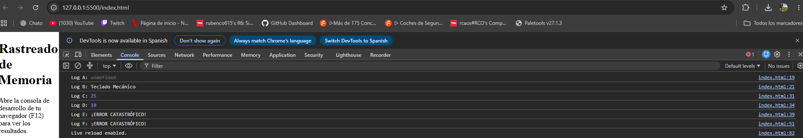

# Actividad 2.3: Variables y ámbitos en JavaScript

## 1. Mis predicciones 

| Identificador | ¿Qué creo que saldrá? | Mi explicación |
| --- | --- | --- |
| **Log A** | `Log A: undefined` | Aquí entra en juego el **hoisting** con `var`. JavaScript "sube" la declaración de `producto` arriba del todo, pero todavía no le ha metido el valor. Por eso existe, pero vale `undefined`. |
| **Log B** | `Log B: Teclado Mecánico` | Aquí ya hemos llegado a la línea donde le asignamos `"Teclado Mecánico"`, así que se imprime el texto sin ningún problema. |
| **Log C** | `Log C: 25` | Al estar dentro del `if`, el `let descuento = 25`. Aunque fuera haya otro `descuento`, dentro del bloque manda esta variable local y muestra `25`. |
| **Log D** | `Log D: 10` | Ya salimos de las llaves del `if`, así que el `let` de dentro desaparece. Volvemos a leer el `var descuento` de la función, que sigue intacto con su valor `10`. `var` tiene ámbito de función, no de bloque. |
| **Log E** | `Log E: ¡ERROR CATASTRÓFICO!` | `impuesto` se creó con `const` dentro del bloque del `if`. Como las constantes tienen ámbito de bloque, fuera del `if` no existe. Al intentar leerla salta un `ReferenceError`, pero como está envuelta en un `try...catch`, el error se captura y nos saca este mensaje de aviso. |
| **Log F** | `Log F: ¡ERROR CATASTRÓFICO!` | Con `let` no pasa como con `var`. Aunque la variable esté declarada una línea más abajo, no podemos leerla antes. Eso lanza otro `ReferenceError` y el `catch` imprime el mensaje de error. |

---

## 2. Comprobación y resultados reales

Para comprobar si había acertado, abrí el archivo `index.html` en el navegador y miré la consola con el botón F12. 

La consola mostró exactamente esto:

---

## 3. Mi conclusión / Lo que he aprendido

1. **`var` es muy traicionero:** Te permite leer variables antes de inicializarlas (devolviendo `undefined` en vez de avisarte con un error) y se salta los bloques `{ }`, lo que puede provocar que sobrescribas datos sin querer dentro de un bucle o un condicional.
2. **`let` y `const` dan mucha más seguridad:** Respetan los bloques donde se declaran y te avisan con un error claro si intentas usarlas antes de tiempo.

